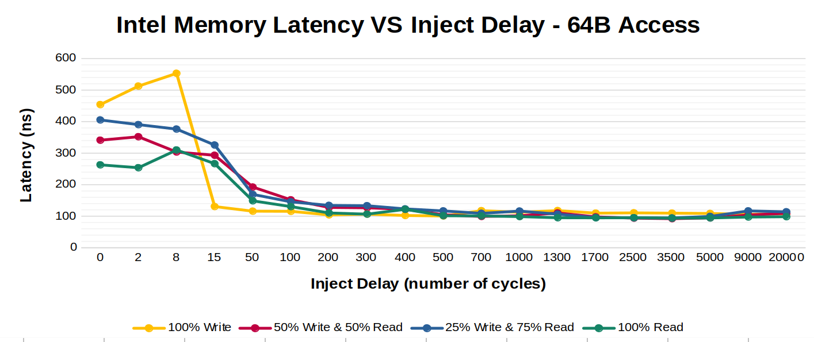
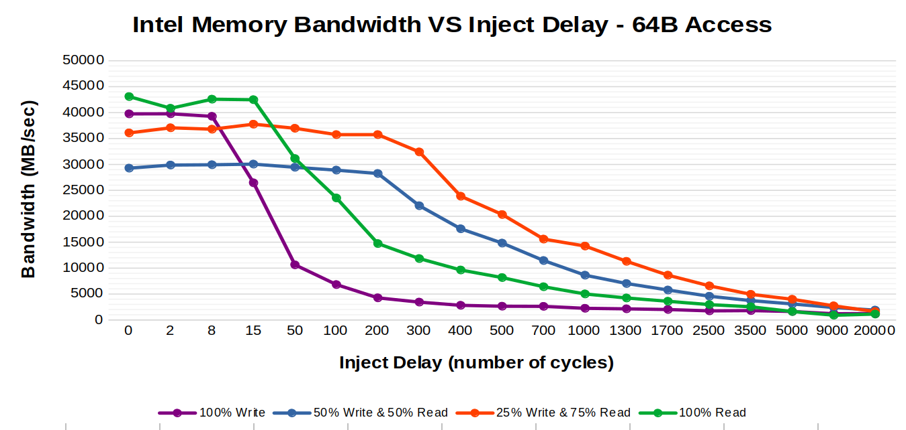
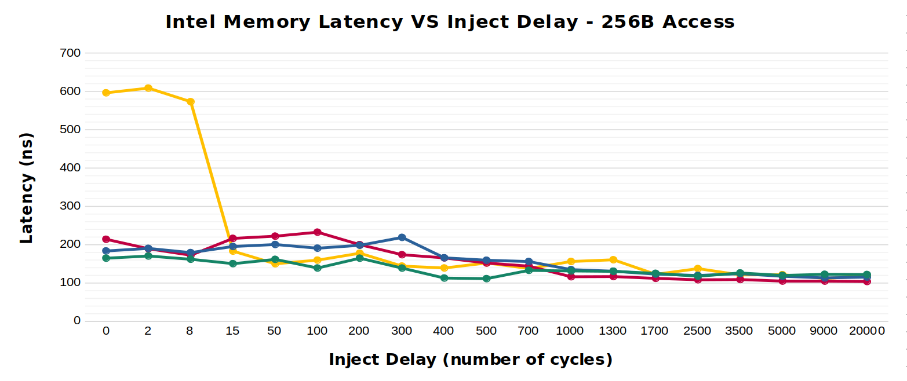
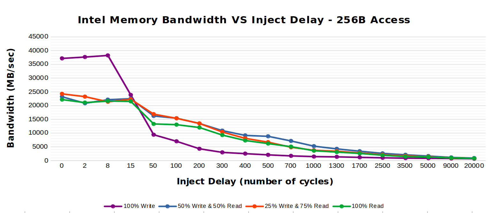

# Project 3: Memory and Storage Performance Profiling
## Overview
### Introduction
In this project, we delve into the operating conditions of modern memory and storage devices. Specifically, we will observe the relationship between data throughput and latency using [Intel's Memory Latency Checker](https://www.intel.com/content/www/us/en/developer/articles/tool/intelr-memory-latency-checker.html) for memory, and the [Flexible IO Tester](https://github.com/axboe/fio) library for storage.

### Queuing Theory
TBD

### Testing Environment
#### System
* Framework Laptop
* WSL2 - Ubuntu 22.04 LTS

#### CPU
* Intel® Core™ i7-1165G7 Processor
  - 4 cores
  - 8 threads
  - 2.8 GHz clock
  - 12 MB cache (L1: 96K, L2: 1.25MB, L3: 12MB)
  
#### Memory
* DDR4 SO-DIMM
* 3200 MHz
* 32GB of Memory

#### Storage
* Vansuny USB 3.1 Flash Drive
* 128 GB of Storage
* 400 MB/s Read Speed
* 240 MB/s Write Speed

## Memory
### Testing Procedure
Using [Intel's Memory Latency Checker](https://www.intel.com/content/www/us/en/developer/articles/tool/intelr-memory-latency-checker.html), we ran different configurations

### Results

### Analysis
TBD

## Storage
### Testing Procedure and Context
TBD

### Results
The following results were obtained on a `Vansuny USB 3.1 Flash Drive` with `128 GB` of storage using an IO Depth of `16`. It should be noted that this flash drive in particular reports to have `400M B/s` and `240 MB/s` read and write speeds, respectively, which is a fairly standard SSD read/write speed (as of the writing of this, i.e. Feb. 2023).  

| Test Type          | Block Size (KB) | IOPS Average | Bandwidth Average (MB/s) | Latency Average (u-sec) |
|--------------------|------------|--------------|--------------------------|-------------------------|
100% Read	| 4	| 275940	| 1056	| 59.8
100% Read	| 32 | 43689 | 1448 | 347
100% Read	| 128	| 11342	| 1473 | 1332
70/30% Read/Write | 4 | 284612 | 997 | 63.3
70/30% Read/Write | 32 | 42597 | 1389 | 362
70/30% Read/Write | 128 | 11058 | 1443 | 1393
100% Write | 4 | 262143 | 1048 | 59.97
100% Write | 32 | 44236 | 1424 | 353.25
100% Write | 128 | 11342 | 1438 | 1399

### Analysis
#### General Analysis
TBD

#### Comparison to Intel Enterprise-Grade SSD
TBD

## Conclusion
TBD
