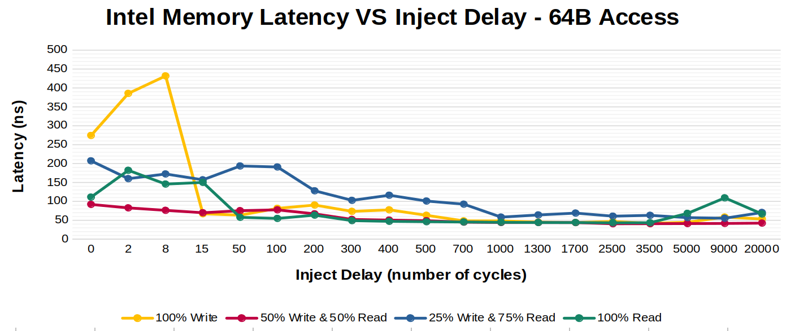
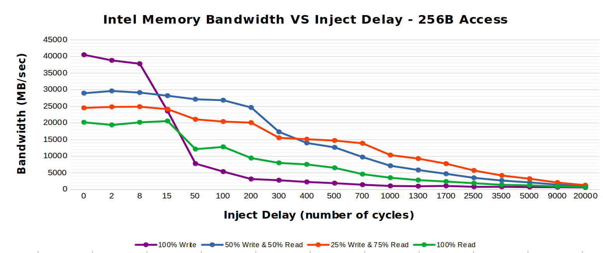

# Project 3: Memory and Storage Performance Profiling
## Overview
In this project, we delve into the operating conditions of modern memory and storage devices. Specifically, we want to observe the relationship between data throughput and latency.

## Testing Environment
**System:** 
* Framework Laptop
* WSL2 - Ubuntu 22.04 LTS

**CPU:**
* Intel® Core™ i7-1165G7 Processor
  - 4 cores
  - 8 threads
  - 2.8 GHz clock
  - 12 MB cache (L1: 96K, L2: 1.25MB, L3: 12MB)

**Memory**
* DDR4 SO-DIMM
* 3200 MHz
* 32GB of Memory

**Storage**
* Vansuny USB 3.1 Flash Drive
* 128 GB of Storage
* 400 MB/s Read Speed
* 240 MB/s Write Speed

#### CPU:

#### Memory:

#### Storage:

In this project, we delve into the operating conditions of modern memory and storage devices. Specifically, we want to observe the relationship between data throughput and latency.

The goal of this project is to develop a deeper understanding of modern memory and storage applications. To explore this topic, we will be using Intel's Memory Latency Checker for Cache and Memory, and Flexible IO Tester for Storage. Since our objecitve is to denote and analyze the performance of memory and storage, we will identify how data access throughput affects latency.

The study on this effect is called Queuing Theory, defined by Merriam-Webster as "The mathematical and statiscal theory of queues and waiting lines." Queuing Theory's most applicable definition of this relationship (assuming a Poisson distribution) states that the average number of requests in a queue (Lqueue) is directly linked to server utilization (μ). The relationship is as follows:

Our experiments will change the number of requests in the queue and measure the latency. Latency is proportionate to utilization. Therefore, if we consider our storage devices to be psuedo-servers, we should be able to derive the referenced equation with a certain leading factor.

## Memory
### Testing Procedure
TBD

### Results
The following results were obtained using `32GB` of `DDR4-3200 RAM`.    

### Analysis
TBD

## Storage
### Testing Procedure
TBD

### Results
The following results were obtained on a `Vansuny USB 3.1 Flash Drive` with `128 GB` of storage using an IO Depth of `16`. It should be noted that this flash drive in particular reports to have `400M B/s` and `240 MB/s` read and write speeds, respectively, which is a fairly standard SSD read/write speed (as of the writing of this, i.e. Feb. 2023).  

| Test Type          | Block Size (KB) | IOPS Average | Bandwidth Average (MB/s) | Latency Average (u-sec) |
|--------------------|------------|--------------|--------------------------|-------------------------|
100% Read	| 4	| 275940	| 1056	| 59.8
100% Read	| 32 | 43689 | 1448 | 347
100% Read	| 128	| 11342	| 1473 | 1332
70/30% Read/Write | 4 | 284612 | 997 | 63.3
70/30% Read/Write | 32 | 42597 | 1389 | 362
70/30% Read/Write | 128 | 11058 | 1443 | 1393
100% Write | 4 | 262143 | 1048 | 59.97
100% Write | 32 | 44236 | 1424 | 353.25
100% Write | 128 | 11342 | 1438 | 1399

### Analysis
TBD

## Conclusion
TBD
